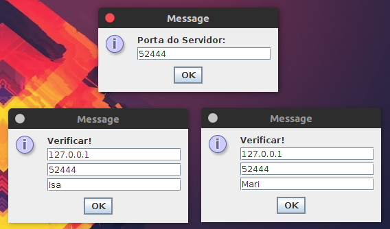
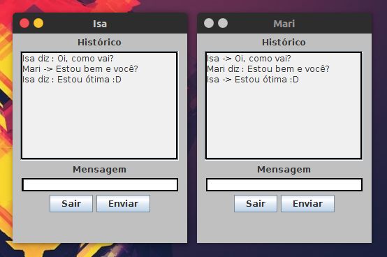
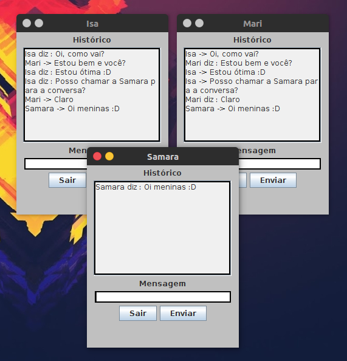

# Chat Multithread com Socket Java

#### Trabalho referente a disciplina de Computação Paralela e Sistemas Distribuídos.

Primeiramente inicia-se o servidor socket com o endereço de IP, estou usando o local porque vou rodar todos no mesmo computador, mas se for em computadores diferentes poderá colocar o IP da rede. Escolha uma porta que não esteja associada a um serviço específico e certifique de que o seu computador não tenha nenhum programa que possa bloquea-la.

Certo disto, adicione o mesmo IP e porta do servidor na janela do cliente, conforme a imagem abaixo:

  

Depois de confirmar a conexão, a conversa poderá ser iniciada. 
Toda mensagem enviada, vai primeiro para o servidor, que depois atualiza para os demais clientes que estão conectados.

  

  

